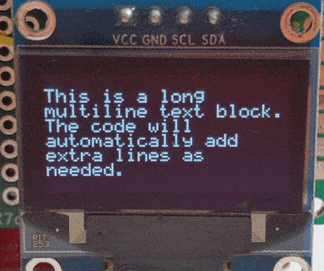
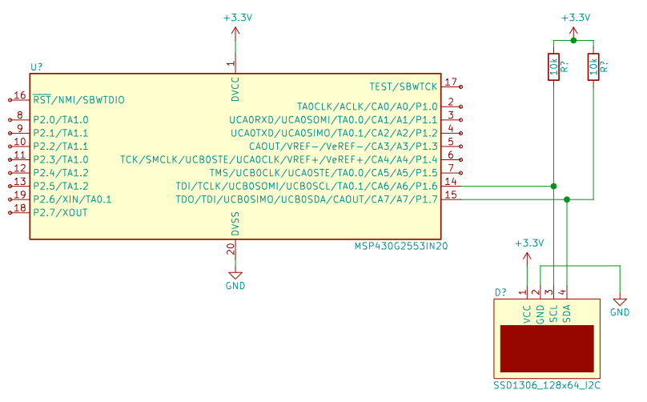

# MSP430G2 SSD1306 OLED Display Library
This is a simple library for interfacing a MSP430G2 LaunchPad with a 128x64 SSD1306 OLED display using i2c. Much of the code for the display has been borrowed from Adafuit's wonderful SSD1306 Arduino library with modifications so that it will work with the limited RAM available on the MSP430G2553.

## Getting Started
### Prerequisites
To use this library you will need the following:
- MSP-EXP430G2 TI LaunchPad or MSP430G2553 uC
- Code Composer Studio
- SSD1306 OLED with I2C
- 2x 10k or other value pullup resistors
- Wires for connecting display to LaunchPad
- Breadboard

The Library was written using Code Composer Studio 9.0.1.00004 and TI MSP430 complier version 18.12.2.LTS. Other versions may work.

### Installing
A working example is available in the [MSP430G_SSD1306](https://github.com/sdp8483/MSP430G2_SSD1306_OLED/tree/master/MSP430G2_SSD1306) subdirectory. Copy the following files from this repository into your Code Composer Studio project:
- `main.c`
- `i2c.h`
- `i2c.c`
- `ssd1306.h`
- `ssd1306.c`
- `font_5x7.h`

Importing it may also work so give that a try.

### Hookup
Connect Vcc on the display to 3.3v on the LaunchPad.  
Connect Gnd on the display to gnd on the LaunchPad.  
Use pullup resistors to connect the SLC and SDA pins to 3.3v.  
Connect SLC on the display to P1.6 on the LaunchPad.  
Connect SDA on the display to P1.7 on the LaunchPad.  

## Usage
The following commands are used:
 
`i2c_init(void)`  
Initialize I2C on P1.6 and P1.7 

`ssd1306_init(void)`  
Initialize SSD1306 display, this sends all the setup commands to configure the display.

`ssd1306_clearDisplay(void)`  
Clear Display  

`ssd1306_printText(uint8_t x, uint8_t y, char *ptString)`  
Print single line of text on row `y` starting at horizontal pixel `x`. There are a total of `7` rows starting at `1`. The horizontal starting position can be from `0` to `127`.

`ssd1306_printTextBlock(uint8_t x, uint8_t y, char *ptString)`  
Print a block of text that can span multiple lines, the code wil automagically split up the text on multiple lines. It will print the text block starting on row `y` at horizontal pixel `x`. There are a total of `7` rows starting at `1`. The horizontal starting position can be from `0` to `127`. Store the text block as a `char` array. Due to a bug add one extra element to the `char` array. For example:  
`char txtBlock[93] = "This is a long multiline text block. The code will automatically add extra lines as needed."`

`void ssd1306_printUI32( uint8_t x, uint8_t y, uint32_t val, uint8_t Hcenter)`  
Print the 32bit unsigned integer `val` on row `y` at horizontal pixel `x`. The code automagically adds thousands comma spacing to enable easy reading of large numbers. Use `Hcenter` to horizontally center the number at row `y` regardless of the value of `x`. `Hcenter` accepts `HCENTERUL_ON` and `HCENTERUL_OFF`.